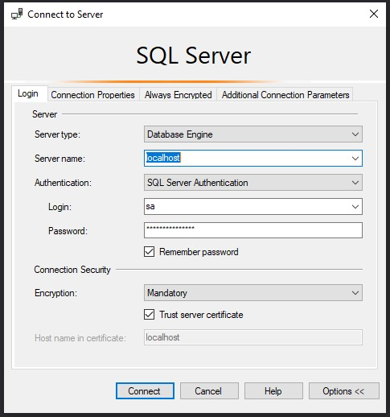

 1 - Copiar y renombrar ```.env.example``` a ```.env``` y definir contraseña

2 - Correr imagen SQL Server docker
```
docker-compose up -d
```
## Para conectarse a SQL Server
* Servidor: localhost
* Usuario: sa
* Contraseña:  lo que hayas definido en tu archivo .env


